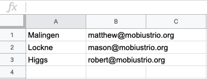

# KS Code Mailer

Simple Python module and script for mailing unique Bandcamp download codes (or another unique, personalized piece of data) to each address in a list of emails using the [Mailgun](https://app.mailgun.com/) API.

## Table of Contents
- [Prerequisites](#prerequisites)
- [Installation](#installation)
- [Contributing](#contributing)
- [Authors](#authors)
- [Acknowledgements](#acknowledgements)

### Prerequisites

You'll need:

* Python 3.6+
* [Requests Library](https://requests.readthedocs.io/en/master/)
* [Mailgun API](https://documentation.mailgun.com/en/latest/api_reference.html)

##### Requests
You can install Requests via the link above, or you can do it through [pip](https://pip.pypa.io/en/stable/) like:

```
pip install requests
```

##### Mailgun
To use the Mailgun API, you have to sign up for Mailgun's service. You have to create an account and sign up for a `Flex Trial` plan, which requires a credit card, but you won't get charged unless you send more than 5,000 emails in a month.

Mailgun requires you to verify your domain, but he Mailgun site has a [Quickstart](https://documentation.mailgun.com/en/latest/quickstart-sending.html) Guide, which will help guide you through those steps. It takes them 24-48 hours to verify your domain, but after that, you can send up to 5,000 emails a month for free.

### Installation

Since this is just a single module and script, there's not much to installation.

* Simply clone this repo from the command line

```
 git clone https://github.com/mholmeslinder/KS2019_Mailgun
```


* Next, we'll create a .csv file that will contain our matched lists of email addresses and whatever unique info - later called {code} in our Python script - needs to be sent to each of those emails.

This is really simple: each email in your list should be in column one in the .csv, and your list of 'codes' (again, this can be anything, but we made this to send individual Bandcamp codes) should be column two.

That way, each email is matched up with the associated 'code'.

The way Kickstarter and Bandcamp spit out emails and codes, this was very simple to make - all I did was copy and paste  the list of codes from Bandcamp into column one, and the  `Emails` column from our Kickstarter Backer Report into column two, like so: 



## Usage

* Fill in relevant details on ./ks_script.py. 

This is where you'll be customizing your email's subject, the address it comes from, and the body text of the email. You'll actually be modifying the code of the Python script to do this.

Here's an excerpt of ks_script.py (`Lines 21-27`)

```python
        # Just plug in your subject 
        subject='cool subject',
        # desired from-address (where the email is coming from)
        from_address='no-reply@thing.com',
        to=recipient,
        # Email body - use {code} where you want to put the Bandcamp code
        body=f'Here is your {code}'
```
Simply replace the strings following `subject`, `from_address`, and `body` with whatever you'd like yours to say, and make sure to use `{code}` in the place where you'd like the email to contain the 'codes' we put in our .csv file earlier.

*  Make sure you're in the correct directory, and then run the `ks_script.py` script `using four arguments`: api key, domain, the filepath to your emails/codes .csv, and a filepath for a log file (for  logs about whether emails were sent successfully).

```
python ks_script.py *your api key* *your mailgun domain* *your emails+codes.csv filepath* *your log_file filepath* 
```

##### Api Key: 
This can be found on the Mailgun site in the [API Security](https://app.mailgun.com/app/account/security/api_keys) tab under `Private API key`.

##### Domain: 
This can be found on mailgun's site in your [Dashboard](https://app.mailgun.com/app/dashboard), under `Sending Domains`.

##### Filepaths: 
These can be anything, just make sure you have them correct. 

## Contributing

Please contact me directly for details on our code of conduct, and the process for submitting pull requests to us.

## Authors

* **Matt Linder** - [mholmeslinder](https://github.com/mholmeslinder)


## Acknowledgments
* A big thanks to the backers for [Mobius Trio](http://mobiustrio.org)'s [Bon Voyage Kickstarter](https://www.kickstarter.com/projects/mobiustrio/bon-voyage-a-new-album-from-mobius-trio
* Big thanks to **Mason Fish [mason-fish](https://github.com/mason-fish)** for being totally awesome and helping me A TON with every part of making things.
